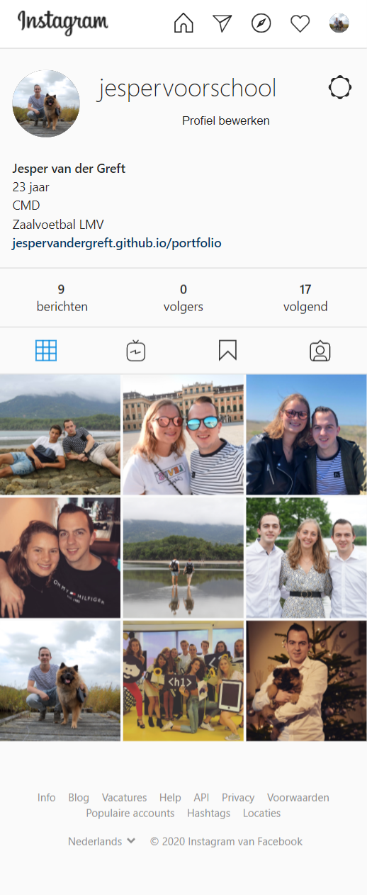
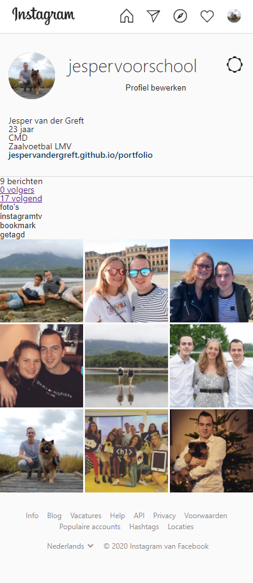
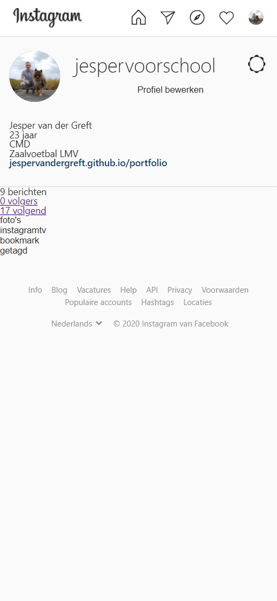
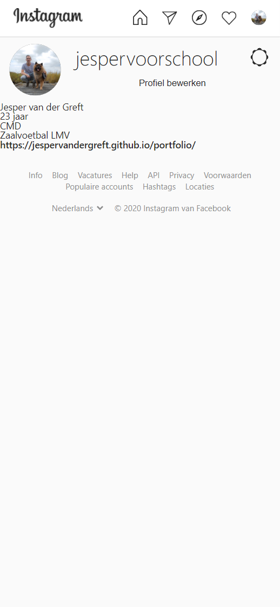
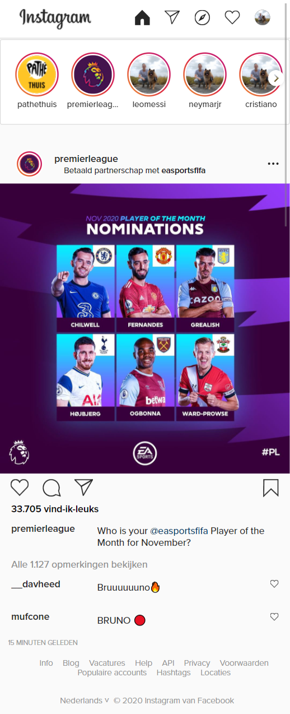
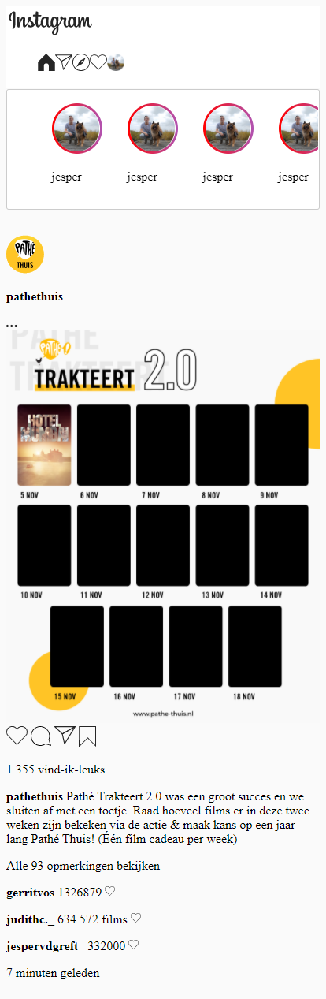
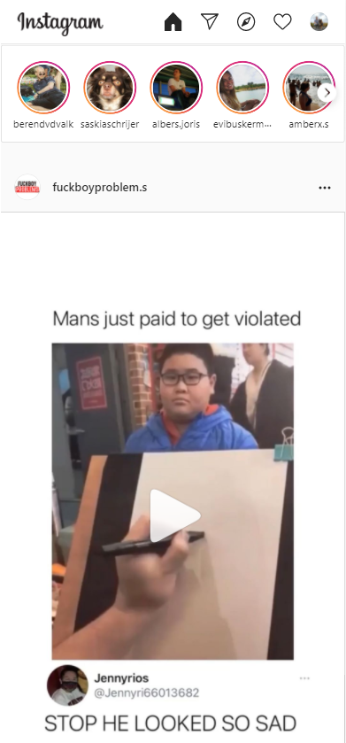
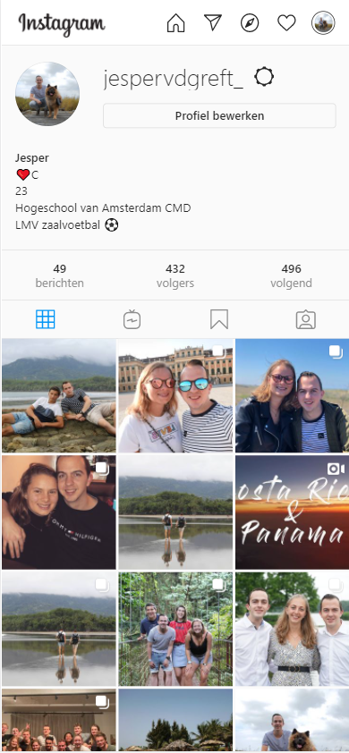
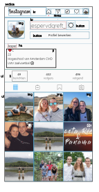

# Procesverslag
**Auteur:** -Jesper van der Greft-

Markdown cheat cheet: [Hulp bij het schrijven van Markdown](https://github.com/adam-p/markdown-here/wiki/Markdown-Cheatsheet). Nb. de standaardstructuur en de spartaanse opmaak zijn helemaal prima. Het gaat om de inhoud van je procesverslag. Besteedt de tijd voor pracht en praal aan je website.

## Bronnenlijst
1. -https://stackoverflow.com/questions/5706963/possible-to-use-border-radius-together-with-a-border-image-which-has-a-gradient-
2. -https://www.instagram.com/-
3. https://developer.mozilla.org/en-US/docs/Web/HTML/Element/details-
4. https://github.com/necolas/normalize.css/issues/665
5. https://blog.wernull.com/2013/04/debug-ghost-css-elements-causing-unwanted-scrolling/ 
6. https://codepen.io/shooft/pen/abNPEga

## Eindgesprek (week 7/8)

-Ik ben echt heel erg trots op het resultaat wat ik heb neergezet met deze opdracht. Aan het begin van dit vak zat ik er echt tegenop om met html en css te gaan werken maar dit is helemaal omgeslagen.
Ik had echt nooit gedacht dat ik html en css leuk zou gaan vinden en dat ik zoiets kon maken als een Instagram website. 

Wat is er goed gegaan?
Eigenlijk heb ik bijna alles kunnen maken wat ik wilde van de homepage en de profielpagina, soms was het even knoeien en lukte het niet maar uiteindelijk kwam ik er wel uit. Het leukste wat ik telkens hoor van andere is dat ze zeggen dat je echt geen verschil ziet tussen de echte Instagram website en die van mij.

Wat ging er minder?
Zoals iedereen die met html en css werkt is het niet fijn als iets niet lukt op de manier waarop je wilt dat het lukt. Dit gebeurde ook tijdens het gebruiken van grid in de reacties sectie van een post, uiteindelijk heb ik er toch maar voor gekozen om flex te gebruiken omdat dit toch beter werkte. Ik heb wel een div moeten gebruiken in de article van de reactie omdat het anders echt niet kon dit was in overleg met Deanne en Justus. Ook om de header van de pagina moest ik uiteindelijk een div plaatsen omdat het niet anders lukte met de background van de header die wel groter moest worden als de pagina ook groter werd.

Helaas ging het javascript gedeelte me niet zo goed af en ben ik niet helemaal tevreden met het eindresultaat van de like buttons.
Ik heb geprobeerd de like animatie naar elke button te laten luisteren met querySelectorAll maar helaas lukte dit niet en ik heb echt alles geprobeerd voor de rest maar ik snap niet waarom het niet werkt op verschillende manieren.-

**Screenshot():**

-screenshot(s) van je eindresultaat-
.png)
.png)
.png)
.png)

## Voortgang 3 (week 6)

### Stand van zaken

-De homepage is helemaal af en responsive.
Ik ben nu bezig met de profielpagina maken die ook zo goed als af is. Daarna moet ik nog valideren en javascript toevoegen aan iets.-

**Screenshot(s):**

-screenshot(s) van hoe ver je bent de homepage is af-

.png)
.png)
.png)

-screenshot(s) van hoe ver je bent de profielpagina bijna af-

### Agenda voor meeting

-Net als de vorige meeting kan ik niet met andere bespreken want niemand is er elke keer.
Voor mezelf wil ik de volgende punten bespreken:

Of de div in de header mag aangezien het volgens mij niet anders kan.

Kijken naar mijn javascript want ik kwam er niet helemaal uit wat ik wilde gaan doen.

Algeme blik naar mijn twee pagina's of het allemaal klopt. -

### Verslag van meeting
- De feedback die ik heb ontvangen:
Ik heb met Deanne de site doorgenomen en dingen waar ik over twijfel of dat goed was.
We hebben besproken dat de div in de header niet anders kan en vandaar dat die er nog steeds staat.
De class van de main zou op de body gezet kunnen worden zodat je een class minder nodig hebt voor de nav van header. Ik heb dit meteen na de meeting geprobeerd maar dit lukte niet omdat een aantal andere dingen dan niet goed kwamen te staan. Als ik dit had gedaan voordat mijn css bijna helemaal klaar was dan was dit wel gelukt maarja toen wist ik nog niet dat ik een div nodig had in me header. Voor de rest hebben we even gekeken naar Javascript wat ik wilde gaan doen en Deanne leek het een goed idee om de like button animatie te maken omdat ik twijfelde tussen dat of het uitklapmenu van de opmerkingen.
Ook moest ik nog even betere alt tekst bij een aantal images neerzetten-

## Screenreader

-Ik merkte eigenlijk met de screenreader dat alles heel logisch staat qua volgorde, alleen de reactie like knop heten eerste like en daardoor leek het net of het ook een normale like knop was, deze heet nu reactie like knop zodat het veel duidelijker is dat de like knop bij de reacties hoort.-

## Voortgang 2 (week 5)

### Stand van zaken

-Het gaat heel erg goed met de homepage van Instagram alleen de reacties sectie moet ik nog verbeteren want dat staat nog niet goed.
Ik moet nog de pagina responsive maken en daarna mijn profielpagina maken.
Ik gebruik viewbox omdat de css anders geladen moet worden en alles verplaatst wanneer ik dit niet zou gebruiken zou de nav groot worden door de svg's.-

**Screenshot(s):**

-screenshot(s) van hoe ver je bent-

### Agenda voor meeting

-Net als de vorige meeting kan ik niet met andere bespreken want niemand is er elke keer.
Voor mezelf wil ik de volgende punten bespreken:
~ Hoe ik de reacties sectie goed kan krijgen
~ Hoe ik het beste de website responsive kan maken en vooral de header
~ Of het goed is hoe ik de footer heb gedaan van de article -

### Verslag van meeting
- De feedback die ik heb ontvangen:
In de footer van de article mag weer een article per reactie een article.

Taal kiezen is een selectbox.

Op de main een margin auto en max-width gezet en op de header geen max-width.

De sections in een main met een class.

Op de zoekbalk inputtype tekst met een button, die zet je op display none en dan bij breakpoints op display.

Met javascript de reacties die er al staan weghalen door display none te zetten op de class dat de details is uitgeklapt.

De foto’s met grid doen voor de profielpagina.-

## Voortgang 1 (week 3)

### Stand van zaken

-Ik vond het lastig om te beginnen met mijn html structuur te geven, het is een hele tijd geleden dat ik
een website heb gemaakt vanaf 0. Na de eerste feedback van mijn eerste html structuur kreeg ik ook gelijk te
horen dat ik moet proberen om niet met classes te werken, ik had dit op internet gezien omdat het daar veel wordt
gebruikt maar inderdaad dit is niet handig. Ik ben mijn html gaan aanpassen a.d.h.v feedback en mijn nieuwe structuur
is veel overzichtelijker en netter.
Toen mijn html goed stond wilde ik ook beginnen met de css, met de hulp van de gemaakte huiswerk opdrachten wist ik nu
hoe ik elementen kon selecteren a.d.h.v selectoren zoals first-of-type.
Ik ben erg blij met mijn eerste voortgang omdat ik toch als best veel voor elkaar heb gekregen in een korte tijd-

**Screenshot(s):**

-screenshot(s) van hoe ver je bent-

### Agenda voor meeting

-Ik heb het idee dat ik helemaal geen groepje heb omdat alle mensen die bij mij zitten nooit aanwezig zijn geweest denk ik. (dit klopte)-

### Verslag van meeting

-De feedback die ik heb ontvangen: 
Even in de readme zetten waarom ik viewbox gebruik bij de header svg.

Profielnamen zijn h2 en die dan stijlen.

Opties icoon misschien op een andere manier maar nog mee wachten.

Volledige url gebruiken met images linken want dan zijn ze op github ook te zien.

In je button tekst zetten wat de button is en de tekst laten verdwijnen, tekst transparant maken.

De p van aantal opmerkingen moet een detail wss worden staat in teams welke opties je daarbij hebt.

Bovenkant van de post met align content doen en flexbox.
-

## Intake (week 1)

**Je startniveau: blauw**

**Je focus: surface plane**

**Je opdracht: https://www.instagram.com/** 

**Screenshot(s):**

&

**Breakdown-schets(en):**

